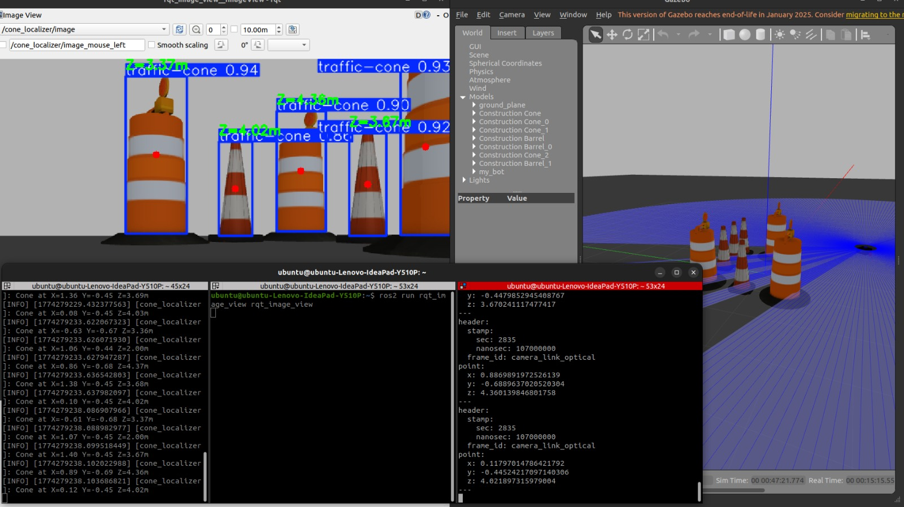

---

# AutoBot — Autonomous Mobile Robot in ROS2

A fully autonomous differential drive robot built from scratch in ROS2 Humble. The robot is capable of mapping unknown environments, localizing itself within a saved map, planning paths, and navigating autonomously while avoiding dynamic obstacles in real time.

Built entirely in simulation using Gazebo, with a modular URDF/Xacro model, LiDAR-based SLAM, and the Nav2 navigation stack.

---

## Demo

> *"Go there." — me*
> *"Say less." — the robot*

Setting a goal pose in RViz:


The robot actually doing it:


Detecting a traffic cone and localizing it in 3D space:



---

## Capabilities

- **Environment Mapping** — builds a 2D occupancy grid map using LiDAR SLAM via slam_toolbox
- **Localization** — determines its position on a saved map using AMCL particle filter
- **Autonomous Navigation** — plans and executes paths to goal poses using the Nav2 stack
- **Real-time Obstacle Avoidance** — detects and navigates around dynamic obstacles not present in the original map. Tested by throwing barrels at it. It was not impressed.
- **Manual Control** — PS3 DualShock controller support via teleop_twist_joy
- **Object Detection** — custom YOLOv8n model trained on 4000+ images, detecting traffic cones in real time (mAP50: 0.984)
- **3D Object Localization** — combines YOLO bounding boxes with depth camera data to compute real-world XYZ position of detected objects
- **Depth Camera** — onboard RGB-D sensor streaming to ROS2 image topics

---

## Tech Stack

| Component | Role |
|---|---|
| ROS2 Humble | Middleware and communication framework |
| Gazebo | Physics simulation environment |
| URDF / Xacro | Robot model definition |
| slam_toolbox | Online asynchronous LiDAR SLAM |
| Nav2 | Full autonomous navigation stack |
| AMCL | Monte Carlo localization |
| Regulated Pure Pursuit | Local path controller |
| NavFn | Global path planner |
| diff_drive plugin | Wheel control and odometry |
| YOLOv8n | Custom trained object detection model |
| OpenCV + cv_bridge | Image processing and ROS2 integration |
| Ultralytics | YOLOv8 training and inference framework |

---

## System Architecture

```
PS3 Controller ──► /cmd_vel ──► diff_drive ──► robot moves
                                    │
                                    ▼
LiDAR ──► /scan ──► slam_toolbox ──► /map
                         │
                         ▼
              AMCL (localization) ──► /amcl_pose
                         │
                         ▼
Goal Pose ──► bt_navigator ──► planner ──► controller ──► /cmd_vel

Camera ──► /camera/image_raw ──► YoloNode ──► /yolo/image_detected
       │
       ├──► /camera/depth/image_raw ──► ConeLocalizer ──► /cone_position
       │
       └──► /camera/camera_info ──────────────┘
```

## Object Detection — Custom YOLOv8 Model

Trained a custom YOLOv8n model to detect traffic cones using a Roboflow dataset of 4030 images.

**Training setup:**
- Platform: Google Colab (T4 GPU)
- Dataset: 3224 train / 806 val images at 640x640
- Epochs: 50, Batch size: 16

**Results:**

| Metric | Value |
|---|---|
| mAP50 | 0.984 |
| mAP50-95 | 0.912 |
| Precision | 0.963 |
| Recall | 0.950 |
| Model size | 6.2MB |
| Inference time | 2.5ms |

The `cone_localizer` node fuses detection results with depth camera data to back-project each detected cone into 3D camera space, publishing its XYZ coordinates as a `geometry_msgs/PointStamped` on `/cone_position`.

---

---

## Getting Started

**Prerequisites:**
- ROS2 Humble
- Gazebo
- nav2_bringup, slam_toolbox, teleop_twist_joy
- ultralytics, cv_bridge, OpenCV

**Install Python dependencies:**
```bash
pip3 install ultralytics "numpy==1.26.4" --user
```

> ⚠️ NumPy must be pinned to 1.x — ROS2 Humble's cv_bridge is incompatible with NumPy 2.x

**Clone and build:**
```bash
git clone git@github.com:yourusername/ros2-autonomous-bot.git
cd ros2-autonomous-bot
colcon build --symlink-install
source install/setup.bash
```

**Launch simulation:**
```bash
ros2 launch my_bot launch_sim.launch.py
```

**Map the environment:**
```bash
ros2 launch my_bot slam.launch.py
```
Drive around with the controller until satisfied with the map, then save:
```bash
cd src/my_bot/maps
ros2 run nav2_map_server map_saver_cli -f map
```

**Autonomous navigation:**
```bash
ros2 launch my_bot navigation.launch.py
```
In RViz, set a **2D Pose Estimate** to initialize localization, then set a **2D Goal Pose** and watch the robot handle the rest.

**Run YOLO detection:**
```bash
ros2 run my_bot yolo_node.py
```

**Run 3D cone localization:**
```bash
ros2 run my_bot cone_localizer.py
```
Echo detected cone positions:
```bash
ros2 topic echo /cone_position
```

---

## Package Structure
```
src/my_bot/
├── config/
│   ├── mapper_params_online_async.yaml
│   ├── nav2_params.yaml
│   └── ps3_custom.yaml
├── description/
│   ├── robot.urdf.xacro
│   ├── robot_core.xacro
│   ├── lidar.xacro
│   ├── camera.xacro
│   ├── gazebo_control.xacro
│   └── inertial_macros.xacro
├── launch/
│   ├── launch_sim.launch.py
│   ├── rsp.launch.py
│   ├── slam.launch.py
│   └── navigation.launch.py
├── maps/
│   ├── map.pgm
│   └── map.yaml
├── models/
│   └── best.pt
└── scripts/
    ├── yolo_node.py
    └── cone_localizer.py
```

---

## What's Next

- Making the robot stop or reroute when a cone is detected in its path
- Multi-waypoint navigation
- Expanding the detection model to include additional object classes
- Exploring Nav2 behaviour trees for more complex navigation logic

---

## Contact

Open to collaborations and discussions around robotics and autonomous systems. Feel free to open an issue or reach out directly.

---

*Tested on ROS2 Humble. Number of `colcon build` commands executed during development: too many to count.*